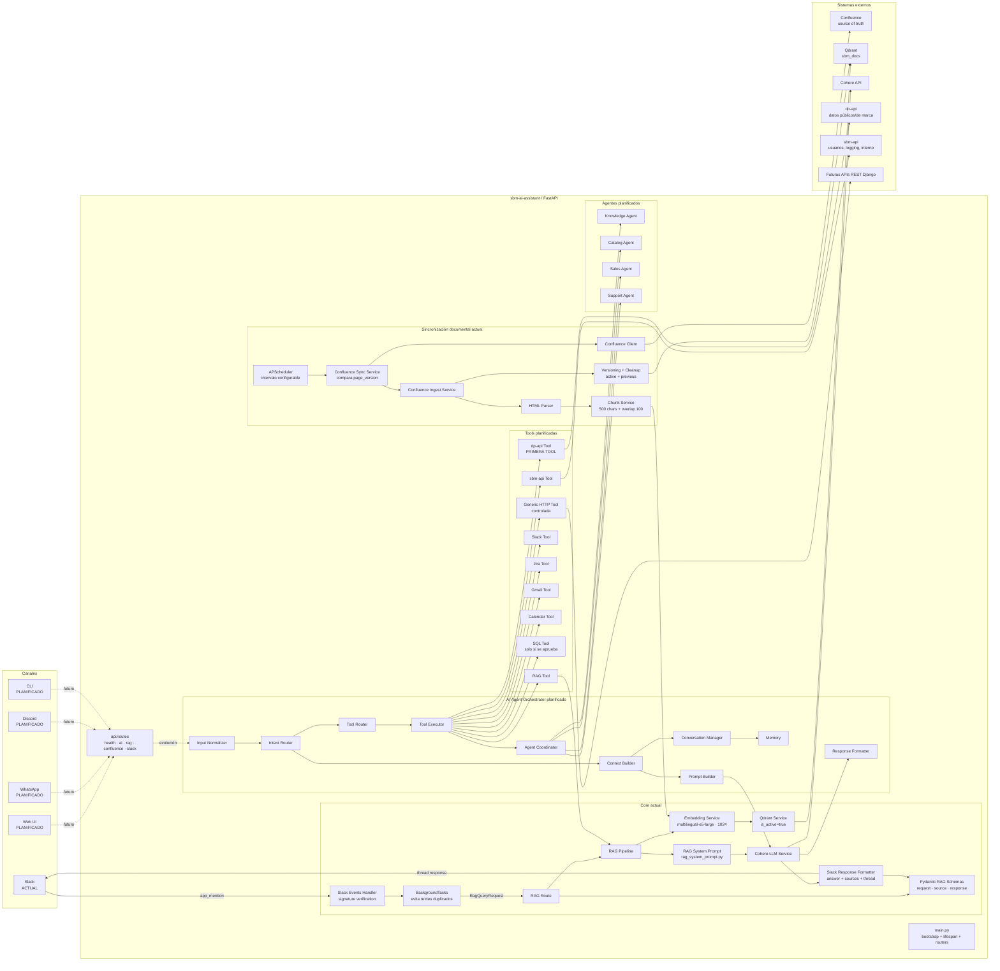
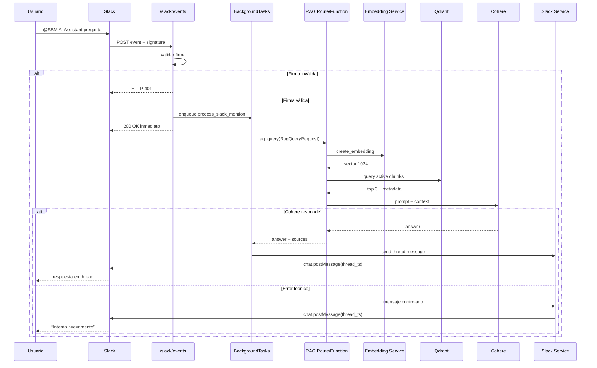
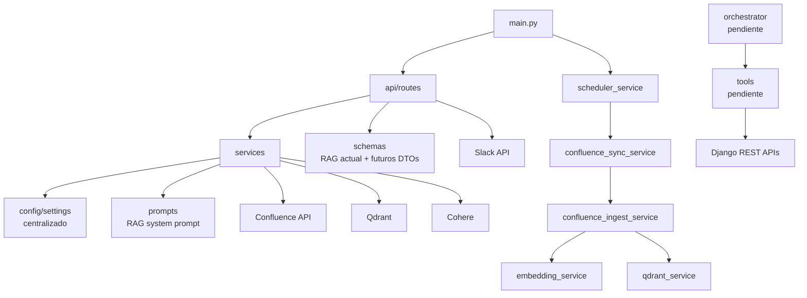

# PROJECT_CONTEXT.md

> **Last updated:** 2026-07-13
>
> **Purpose of this file**
>
> This document is persistent project memory for an LLM. It is **not** a README, onboarding guide, product brochure, or installation tutorial. It preserves the technical, architectural, product, and historical context required to continue the project in a new conversation without access to the original chat.
>
> **Accuracy note**
>
> The state described here is based on the development conversation and the code snippets explicitly shared by the user. The repository itself was not uploaded or independently inspected. Paths, files, functions, endpoints, and behaviors marked as implemented were explicitly created, shown, or validated during the conversation. Where repository state was discussed but not independently confirmed, this document says so.

---

## 1. Objetivo del proyecto

### 1.1 Problema que resuelve actualmente

`sbm-ai-assistant` comenzó como una solución RAG interna para resolver un problema operativo concreto:

- La documentación empresarial vive en Confluence.
- Esa documentación cambia con el tiempo.
- Los usuarios no técnicos no deberían buscar manualmente entre páginas ni consultar una API con Postman.
- El asistente debe responder usando únicamente documentación oficial.
- Las respuestas deben indicar la fuente y la versión utilizada.
- La base vectorial debe mantenerse actualizada automáticamente cuando cambia Confluence.
- El canal de interacción real para usuarios de negocio debe ser Slack.

La primera solución funcional permite que un usuario mencione al bot en Slack, formule una pregunta operacional y reciba una respuesta en un thread basada en documentación sincronizada desde Confluence.

### 1.2 Qué se está construyendo

La visión evolucionó desde un “asistente RAG para documentación” hacia un **AI Agent Orchestrator central para SBM Manager Suite**.

La responsabilidad futura del repositorio será:

- Recibir solicitudes desde canales como Slack.
- Interpretar la intención del usuario.
- Decidir si debe consultar documentación mediante RAG.
- Decidir qué Tool debe ejecutar.
- Consumir una o más APIs REST del ecosistema SBM.
- Coordinar agentes o módulos especializados cuando sea necesario.
- Construir contexto y prompts.
- Invocar un LLM.
- Formatear y devolver la respuesta.
- Mantener trazabilidad técnica y fuentes.

El repositorio no debe convertirse en una copia de las APIs de negocio. Debe permanecer como una capa de orquestación e inteligencia.

### 1.3 Visión de largo plazo

La visión de largo plazo es un único asistente transversal para un ERP multimarca, inicialmente con cuatro marcas, evitando crear un agente aislado por cada marca.

Flujo conceptual futuro:

```text
Usuario
→ Slack / Web / otro canal
→ SBM AI Assistant
→ detección de intención
→ selección de Tool o agente
→ una o más APIs REST Django
→ consolidación de resultados
→ LLM
→ respuesta
```

Ejemplos de intención futura:

```text
“¿Qué dice el procedimiento de apertura?”
→ RAG Tool
→ Confluence / Qdrant
```

```text
“¿Cuál es el precio vigente del producto X?”
→ ERP/API Tool
→ dp-api
```

```text
“Genera una cotización para el cliente Y”
→ futuro Sales Agent
→ clientes + productos + servicios + precios
```

### 1.4 Qué NO pretende resolver

Este repositorio no debe:

- Implementar la lógica de negocio del ERP.
- Sustituir las APIs Django existentes.
- Gestionar directamente reglas de precios.
- Reimplementar CRUD de productos, materiales, servicios, catálogos, precios o clientes.
- Gestionar usuarios, logging interno o permisos propios del dominio de `sbm-api`.
- Convertirse en una aplicación monolítica de negocio.
- Crear un repositorio separado por cada marca.
- Mantener una base de datos transaccional paralela a las APIs del ERP.
- Permitir que el LLM ejecute acciones no validadas directamente.
- Inventar respuestas cuando no exista evidencia en la documentación o en una Tool.

### 1.5 Casos de uso actuales

1. Consulta de documentación operacional desde Slack.
2. Respuesta RAG estricta con fuentes.
3. Sincronización incremental de Confluence hacia Qdrant.
4. Ingesta manual de una página.
5. Ingesta manual de un espacio.
6. Sincronización automática mediante scheduler.
7. Consulta directa por endpoint REST para pruebas o integraciones.
8. Diagnóstico técnico de embeddings, búsqueda vectorial y Qdrant.

### 1.6 Casos de uso futuros prioritarios

1. Consultar datos de negocio mediante una Tool para `dp-api`.
2. Enrutar automáticamente entre RAG y APIs.
3. Consultar productos, materiales, servicios, catálogos, precios y clientes.
4. Operar transversalmente sobre múltiples marcas.
5. Añadir agentes especializados solo cuando exista una necesidad real.
6. Mantener el mismo canal de Slack como interfaz principal inicial.

### 1.7 Público objetivo

#### Usuarios actuales

- Operaciones.
- Administración.
- Soporte interno.
- Personal que necesita consultar procedimientos o documentación.
- Usuarios no técnicos que trabajan en Slack.

#### Público técnico

- AI Engineers.
- Backend Engineers.
- Arquitectos de integración.
- Evaluadores de portafolio técnico.
- Equipos que necesiten integrar LLM, RAG, Confluence, Qdrant, Slack y APIs REST.

---

## 2. Estado actual

### 2.1 Estado general

El core funcional del primer release está completo y probado:

```text
Confluence
→ sincronización incremental
→ limpieza HTML
→ chunking
→ embeddings multilingües
→ Qdrant
→ recuperación semántica
→ Cohere
→ respuesta con fuentes
→ Slack thread
```

Posteriormente se completó el refactor arquitectónico base planificado para el MVP: rutas separadas, `main.py` reducido a bootstrap, configuración centralizada en `settings.py`, prompt RAG extraído a `app/prompts` y primer contrato Pydantic aplicado al endpoint RAG. La siguiente fase es iniciar la capa `tools` y la integración de lectura con `dp-api`.

### 2.2 Qué ya funciona

#### Infraestructura

- FastAPI.
- Docker Compose.
- Contenedor backend.
- Contenedor Qdrant.
- Volumen persistente para Qdrant.
- Entorno local ejecutado principalmente con Docker.
- `.venv` local creado solo para Cursor/Pylance/autocompletado; no es el runtime oficial.
- Cursor usa el `.venv` como intérprete para resolver imports.
- La aplicación sigue ejecutándose en Docker.

#### RAG

- Embeddings con `intfloat/multilingual-e5-large`.
- Vectores de 1024 dimensiones.
- Qdrant con distancia coseno.
- Búsqueda limitada a puntos con `is_active=true`.
- Cohere Chat V2.
- Prompt RAG estricto.
- Respuesta con fuentes auditables.
- Fallback documental:
  - `No está especificado en la documentación disponible.`

#### Confluence

- Conexión autenticada mediante REST API.
- Lectura del espacio configurado.
- Listado de páginas.
- Lectura de `body.storage`.
- Conversión HTML a texto.
- División en chunks.
- Ingesta individual.
- Ingesta completa del espacio.
- Sync incremental por `page_version`.
- Exclusión por títulos configurables.
- Versionado por:
  - `page_version`
  - `sync_run_id`
  - `is_active`
- Retención:
  - versión actual activa;
  - una versión anterior inactiva;
  - versiones inactivas más antiguas eliminadas.
- Scheduler automático.
- Intervalo configurable.
- El scheduler se inicia con el `lifespan` de FastAPI.

#### Slack

- Slack App creada con nombre `SBM AI Assistant`.
- Scope actual confirmado:
  - `chat:write`
- Evento confirmado:
  - `app_mention`
- Canal de prueba:
  - `#sbm-assistant`
  - Channel ID: `C0BGR657ZFG`
- Envío backend → Slack.
- Recepción Slack → backend mediante Event Subscriptions.
- Validación de firma con `SLACK_SIGNING_SECRET`.
- Procesamiento en `BackgroundTasks`.
- Respuesta en thread usando el `ts` del mensaje original.
- Prevención de duplicados causados por retries de Slack.
- Manejo de error técnico visible para el usuario:
  - `No pude generar la respuesta. Intenta nuevamente.`

#### Estructura de rutas

Las rutas fueron extraídas de `main.py` y separadas en:

- `health.py`
- `rag.py`
- `slack.py`
- `confluence.py`
- `ai.py`

`main.py` quedó como bootstrap:

- crea FastAPI;
- registra routers;
- arranca scheduler.

#### Configuración

- Se creó `backend/app/config/settings.py`.
- La migración de configuración del alcance actual quedó completada.
- `llm_service.py` consume `COHERE_API_KEY` y `COHERE_MODEL` desde `settings.py`.
- `qdrant_service.py` consume `QDRANT_URL` y `QDRANT_COLLECTION_NAME` desde `settings.py`.
- `confluence_client.py` consume `CONFLUENCE_BASE_URL`, `CONFLUENCE_EMAIL`, `CONFLUENCE_API_TOKEN` y `CONFLUENCE_SPACE_KEY` desde `settings.py`.
- `confluence_sync_service.py` consume `CONFLUENCE_EXCLUDED_TITLES` desde `settings.py`.
- `scheduler_service.py` consume `CONFLUENCE_SYNC_INTERVAL_MINUTES` desde `settings.py`.
- `slack_service.py` consume `SLACK_BOT_TOKEN` desde `settings.py`.
- `api/routes/slack.py` consume `SLACK_SIGNING_SECRET` desde `settings.py`.
- Se eliminaron los `os.getenv` locales de esos archivos.
- `.env.example` fue reemplazado por `.env.dev`.
- `docker-compose.yml` fue actualizado para usar `.env.dev`.
- `.env.prod` fue planificado como archivo vacío hasta el primer deploy; su existencia final no fue confirmada explícitamente.
- La política Git de `.env.dev` y `.env.prod` aún debe verificarse antes de publicar o desplegar.

#### Prompts

- Se creó `backend/app/prompts/rag_system_prompt.py`.
- El prompt de sistema RAG vive en la constante `RAG_SYSTEM_PROMPT`.
- `llm_service.py` importa `RAG_SYSTEM_PROMPT`.
- El prompt de usuario con `Contexto` y `Pregunta` sigue construyéndose dentro de `generate_answer`.
- Todavía no existe un Prompt Builder formal; no es necesario hasta que existan múltiples Tools o agentes.

Contenido confirmado:

```python
RAG_SYSTEM_PROMPT = """
Eres un asistente RAG estricto.

Reglas:
1. Responde únicamente con información presente explícitamente en el contexto.
2. No agregues ejemplos, supuestos, inferencias ni conocimiento externo.
3. Si el contexto no contiene suficiente información, responde: "No está especificado en la documentación disponible."
4. No inventes estados, funcionalidades, nombres de módulos ni detalles operativos.
5. Responde de forma breve y directa.
"""
```

#### Schemas Pydantic

- Se creó `backend/app/schemas/rag.py`.
- Modelos actuales:
  - `RagQueryRequest`
  - `RagSource`
  - `RagQueryResponse`
- `RagQueryRequest.question` exige una cadena con longitud mínima de 1.
- `RagSource` conserva toda la metadata devuelta actualmente:
  - `source`
  - `page_id`
  - `page_title`
  - `page_version`
  - `chunk_index`
  - `score`
- `RagQueryResponse` expone:
  - `question`
  - `answer`
  - `sources`
- `POST /rag/query` recibe `RagQueryRequest` y declara `response_model=RagQueryResponse`.
- FastAPI documenta y valida ese contrato en OpenAPI/Swagger.
- `api/routes/slack.py` construye `RagQueryRequest(question=question)` antes de reutilizar `rag_query`.
- Una mención real en Slack fue validada correctamente después del cambio a Pydantic.
- Los demás endpoints todavía pueden usar `dict`; se crearán schemas adicionales cuando aparezca una necesidad real.

Contenido confirmado:

```python
from pydantic import BaseModel, Field


class RagQueryRequest(BaseModel):
    question: str = Field(min_length=1)


class RagSource(BaseModel):
    source: str | None = None
    page_id: str | None = None
    page_title: str | None = None
    page_version: int | None = None
    chunk_index: int | None = None
    score: float


class RagQueryResponse(BaseModel):
    question: str
    answer: str
    sources: list[RagSource]
```

Firma actual del endpoint:

```python
@router.post(
    "/query",
    response_model=RagQueryResponse,
)
def rag_query(data: RagQueryRequest):
    question = data.question
```

Adaptación confirmada en Slack:

```python
rag_response = rag_query(
    RagQueryRequest(question=question)
)
```

### 2.3 Qué está parcialmente implementado

#### Schemas

La primera migración Pydantic está completada para RAG:

```text
POST /rag/query
→ RagQueryRequest
→ RagQueryResponse
→ RagSource
```

Estado restante:

- `/slack/test` continúa recibiendo `data: dict`.
- `/slack/rag` continúa recibiendo `data: dict`.
- Las rutas de Confluence y los endpoints técnicos de `ai.py` no fueron migrados en esta fase.
- La decisión es crear DTOs adicionales de forma incremental, cuando un endpoint se modifique o una Tool necesite contrato propio, evitando diseñar schemas sin uso real.

#### Separación del pipeline RAG

El endpoint y Slack siguen reutilizando la función `rag_query` definida en la capa HTTP:

```text
api/routes/slack.py
→ importa rag_query desde api/routes/rag.py
```

Esto funciona y fue validado, pero sigue siendo deuda arquitectónica. En el futuro el pipeline deberá moverse a un `rag_service.py`, para que tanto la ruta RAG como Slack dependan de un servicio y no de otra route.

#### Orquestador

La visión está definida, pero todavía no existe:

- intent router;
- agent orchestrator;
- tool router;
- tool executor;
- prompt builder independiente;
- context builder independiente;
- conversation manager;
- memory;
- agentes especializados;
- Tool para `dp-api`.

#### API Tool para ERP

La siguiente gran integración será una Tool para consumir `dp-api`, pero aún no comenzó.

### 2.4 Qué todavía no existe

- Tool `dp-api`.
- Router de intención.
- Orquestador de agentes.
- Agente de catálogo.
- Agente comercial.
- Agente de soporte.
- Multiagente real.
- Memoria conversacional.
- Context builder formal.
- Prompt builder formal.
- Registro de ejecuciones de Tools.
- Métricas de uso.
- Evaluación automática de RAG.
- Tests automatizados.
- CI/CD documentado.
- Deploy productivo.
- URL pública estable.
- Webhook de Confluence.
- Frontend propio.
- Integración con WhatsApp, Discord o Web.
- MCP.
- Autenticación propia de los endpoints REST del asistente.
- Control de autorización por usuario de Slack.
- Rate limiting propio.
- Retry del proveedor LLM.
- Fallback entre proveedores LLM.
- Observabilidad centralizada.

### 2.5 Decisiones recientes que cambiaron el rumbo

1. Se decidió mantener `sbm-ai-assistant` como repositorio definitivo.
2. Se descartó crear un repositorio separado por marca.
3. Se redefinió el repositorio como futuro **AI Agent Orchestrator**.
4. Se decidió comenzar con Tools/módulos especializados antes que múltiples agentes LLM independientes.
5. Se priorizó limpiar arquitectura antes de integrar `dp-api`.
6. Se separaron rutas HTTP de servicios.
7. Se inició centralización de variables de entorno.
8. Se decidió separar el system prompt en un archivo propio.
9. Se mantendrá Slack como canal real de negocio.
10. Postman queda como herramienta técnica de validación, no como interfaz de usuario.
11. Se completó la centralización de configuración del alcance actual en `settings.py`.
12. Se movió el prompt de sistema RAG a `backend/app/prompts/rag_system_prompt.py`.
13. Se creó el primer contrato Pydantic en `backend/app/schemas/rag.py`.
14. Se tipó `POST /rag/query` con `RagQueryRequest` y `RagQueryResponse`.
15. Slack fue adaptado para construir `RagQueryRequest` antes de reutilizar el RAG.
16. Se validó una mención real en Slack después de los cambios.
17. Se decidió no crear más schemas por adelantado; se añadirán según necesidad.
18. Se cerró el refactor base del MVP y la siguiente fase pasa a `tools/` y `dp-api`.

---

## 3. Roadmap completo

### Leyenda

- ✅ Completado
- 🚧 En progreso
- ⏳ Pendiente

### Fase 0 — Base del repositorio

#### 0.1 Crear repositorio `sbm-ai-assistant`

- Estado: ✅
- Objetivo: disponer de un backend independiente para capacidades de IA.
- Resultado esperado: repositorio versionado en Git.
- Dependencias: Git, Docker.
- Motivo: separar IA/orquestación de las APIs de negocio.
- Riesgos: convertirlo accidentalmente en otra API de negocio.
- Próximo paso histórico: FastAPI + Docker + Qdrant.

#### 0.2 Descripción del repositorio

- Estado: ✅
- Descripción elegida:
  - `RAG-based AI assistant for SBM Manager with Confluence sync, Qdrant vector search, and Cohere-generated answers.`
- Evolución futura: la descripción debería actualizarse cuando el orquestador y las Tools existan.

### Fase 1 — Infraestructura RAG

#### 1.1 FastAPI y health check

- Estado: ✅
- Endpoint:
  - `GET /health`
- Resultado: `{"status": "ok"}`

#### 1.2 Docker Compose

- Estado: ✅
- Servicios:
  - backend;
  - qdrant.
- Volumen:
  - `qdrant_data`.
- Regla operacional:
  - cambios Python → `docker compose restart backend`;
  - dependencias/Dockerfile/Compose/env file → recrear contenedores según corresponda;
  - evitar `docker compose down -v` porque elimina datos de Qdrant.

#### 1.3 Embeddings

- Estado: ✅
- Modelo:
  - `intfloat/multilingual-e5-large`
- Dimensión:
  - 1024.
- Razón:
  - documentación en español;
  - reemplazó `BAAI/bge-small-en-v1.5`, que era de 384 dimensiones y más orientado a inglés.
- Riesgo conocido:
  - warning de FastEmbed sobre mean pooling;
  - warning por solicitudes no autenticadas a Hugging Face;
  - descarga inicial lenta.

#### 1.4 Qdrant

- Estado: ✅
- Collection:
  - `sbm_docs`
- Distancia:
  - cosine.
- Estrategia:
  - una collection por dominio de búsqueda, no una por página.
- Riesgo:
  - configuración de vector size debe coincidir con el modelo.

#### 1.5 Cohere

- Estado: ✅ funcional, con limitaciones conocidas.
- Modelo:
  - `command-a-03-2025`
- SDK:
  - `cohere.ClientV2`
- Riesgo:
  - se observó `422 NO_VALID_RESPONSE_GENERATED`.
- Mitigación actual:
  - captura de errores al responder desde Slack.
- Pendiente:
  - retry;
  - fallback;
  - posible migración futura a OpenAI o Anthropic.

### Fase 2 — Confluence como source of truth

#### 2.1 Cliente Confluence

- Estado: ✅
- Funciones:
  - conexión;
  - listado de páginas;
  - lectura de página.
- Source of truth:
  - Confluence.
- Qdrant:
  - índice derivado, no fuente primaria.

#### 2.2 HTML parser

- Estado: ✅
- Librerías:
  - BeautifulSoup;
  - `html.unescape`.
- Resultado:
  - texto limpio con líneas vacías removidas.

#### 2.3 Chunking básico

- Estado: ✅
- Estrategia:
  - caracteres;
  - tamaño 500;
  - overlap 100.
- Decisión:
  - no hacer un chunk por línea;
  - mejorar a chunking semántico por sección cuando exista documentación real suficiente.
- Riesgo:
  - una página corta produce un solo chunk;
  - títulos y procedimientos podrían quedar combinados.

#### 2.4 Ingesta individual

- Estado: ✅
- Endpoint:
  - `POST /confluence/pages/{page_id}/ingest`
- Resultado:
  - chunks;
  - embeddings;
  - metadata;
  - versionado.

#### 2.5 Ingesta del espacio

- Estado: ✅
- Endpoint:
  - `POST /confluence/ingest`
- Exclusiones:
  - configuradas por título.
- Páginas excluidas actuales:
  - `Descripción general`
  - `Notas en el espacio`

### Fase 3 — Sync incremental

#### 3.1 Comparar `page_version`

- Estado: ✅
- Lógica:
  - versión Confluence;
  - versión activa Qdrant;
  - skip si son iguales;
  - ingest si difieren.

#### 3.2 Endpoint manual de sync

- Estado: ✅
- Endpoint:
  - `POST /confluence/sync`
- Resultado:
  - checked;
  - indexed;
  - skipped;
  - reasons.

#### 3.3 Scheduler

- Estado: ✅
- Librería:
  - APScheduler.
- Intervalo:
  - 5 minutos por configuración.
- Desarrollo:
  - se validó inicialmente con 1 minuto.
- Riesgo:
  - si el equipo duerme, APScheduler puede informar un missed run.
- Decisión:
  - polling incremental para portafolio;
  - webhook de Confluence queda como evolución;
  - arquitectura empresarial ideal: webhook + polling de respaldo.

#### 3.4 Versionado seguro

- Estado: ✅
- Secuencia:
  1. guardar nueva ingesta como activa;
  2. desactivar syncs anteriores;
  3. eliminar inactivos de la misma versión;
  4. retener solo una versión anterior;
  5. eliminar versiones antiguas.
- Razón:
  - evitar borrar datos antes de confirmar una nueva ingesta.
- Beneficio:
  - rollback básico.

### Fase 4 — Slack como interfaz de negocio

#### 4.1 Slack App

- Estado: ✅
- Nombre:
  - `SBM AI Assistant`

#### 4.2 Envío de mensajes

- Estado: ✅
- Endpoint de prueba:
  - `POST /slack/test`
- Servicio:
  - `slack_service.py`

#### 4.3 Slack + RAG por API

- Estado: ✅
- Endpoint:
  - `POST /slack/rag`
- Uso:
  - prueba técnica;
  - integraciones internas;
  - no es la interfaz primaria del usuario final.

#### 4.4 Event Subscriptions

- Estado: ✅
- Endpoint:
  - `POST /slack/events`
- Evento:
  - `app_mention`
- Exposición:
  - ngrok durante desarrollo.

#### 4.5 Background processing

- Estado: ✅
- Motivo:
  - responder rápido a Slack;
  - evitar retries y mensajes duplicados.
- Implementación:
  - `BackgroundTasks`.

#### 4.6 Threads

- Estado: ✅
- Respuesta:
  - usa `event["ts"]` como `thread_ts`.

#### 4.7 Seguridad Slack

- Estado: ✅
- Validación:
  - `SignatureVerifier`
  - `SLACK_SIGNING_SECRET`
- Respuesta inválida:
  - HTTP 401.

#### 4.8 Manejo de error

- Estado: ✅ básico.
- Mensaje:
  - `No pude generar la respuesta. Intenta nuevamente.`
- Pendiente:
  - logging de excepción;
  - clasificación de errores;
  - retry.

### Fase 5 — Refactor de arquitectura

#### 5.1 Separar rutas

- Estado: ✅
- Archivos:
  - `health.py`
  - `rag.py`
  - `slack.py`
  - `confluence.py`
  - `ai.py`

#### 5.2 Separar ingesta Confluence

- Estado: ✅
- Archivo:
  - `confluence_ingest_service.py`
- Beneficio:
  - reutilización desde route, sync y scheduler.

#### 5.3 Limpiar `main.py`

- Estado: ✅
- Responsabilidades actuales:
  - lifespan;
  - creación FastAPI;
  - include_router.

#### 5.4 Centralizar configuración

- Estado: ✅
- Archivo:
  - `backend/app/config/settings.py`
- Migraciones completadas:
  - LLM;
  - Qdrant;
  - cliente Confluence;
  - exclusiones de sync Confluence;
  - scheduler;
  - Slack Web API;
  - Slack signing secret.
- Archivos confirmados usando settings:
  - `llm_service.py`
  - `qdrant_service.py`
  - `confluence_client.py`
  - `confluence_sync_service.py`
  - `scheduler_service.py`
  - `slack_service.py`
  - `api/routes/slack.py`
- Validación:
  - backend reiniciado;
  - sincronización Confluence funcional;
  - Slack funcional.

#### 5.5 Entornos

- Estado: 🚧/✅ parcial.
- Cambios confirmados:
  - `.env.dev`;
  - Compose usa `.env.dev`.
- Pendiente de confirmar:
  - `.env.prod` vacío;
  - política Git de ambos archivos;
  - plantilla segura para nuevos entornos.

#### 5.6 Prompt separado

- Estado: ✅
- Archivo:
  - `backend/app/prompts/rag_system_prompt.py`
- Constante:
  - `RAG_SYSTEM_PROMPT`
- Integración:
  - `llm_service.py` importa la constante.
- Alcance:
  - solo el system prompt fue externalizado;
  - el mensaje de usuario se construye todavía dentro de `generate_answer`;
  - un Prompt Builder formal sigue pendiente hasta que existan múltiples Tools o agentes.

#### 5.7 Schemas Pydantic

- Estado: ✅ para el flujo RAG actual; incremental para futuros endpoints.
- Archivo:
  - `backend/app/schemas/rag.py`
- Modelos:
  - `RagQueryRequest`
  - `RagSource`
  - `RagQueryResponse`
- Aplicación:
  - `POST /rag/query` recibe `RagQueryRequest`;
  - declara `response_model=RagQueryResponse`;
  - usa `data.question` en lugar de `data["question"]`;
  - Swagger/OpenAPI muestra el contrato tipado.
- Slack:
  - `process_slack_mention` crea `RagQueryRequest(question=question)`;
  - `POST /slack/rag` crea `RagQueryRequest(question=question)`.
- Validación:
  - mención real en Slack funcionando después de la migración.
- Decisión:
  - no migrar todos los endpoints por anticipado;
  - crear nuevos schemas cuando se modifiquen endpoints o se implementen Tools.

### Fase 6 — Evolución a orquestador

#### 6.1 Tool para `dp-api`

- Estado: ⏳
- Es el siguiente desarrollo funcional después del refactor.
- Objetivo:
  - consultar datos de marca y ERP.
- Módulos iniciales disponibles:
  - productos;
  - materiales;
  - servicios;
  - catálogos;
  - precios;
  - clientes.
- No disponibles aún en ERP:
  - marketing;
  - finanzas;
  - otros módulos inconclusos.

#### 6.2 Intent router

- Estado: ⏳
- Objetivo:
  - distinguir documentación vs datos ERP vs futuras acciones.

#### 6.3 Tool router y executor

- Estado: ⏳
- Objetivo:
  - invocar la Tool correcta;
  - validar inputs;
  - devolver salida estructurada.

#### 6.4 Agentes especializados

- Estado: ⏳
- Decisión:
  - no crear múltiples LLM independientes inicialmente.
- Primera estrategia:
  - un orquestador con Tools.
- Agentes futuros posibles:
  - Knowledge Agent;
  - Catalog Agent;
  - Sales Agent;
  - Support Agent.

#### 6.5 Memory y conversación

- Estado: ⏳
- No existe todavía.
- Slack threads no equivalen a memoria del agente.

#### 6.6 Observabilidad y evaluación

- Estado: ⏳
- Pendiente:
  - trazas;
  - duración;
  - Tool calls;
  - errores;
  - token usage;
  - feedback;
  - dataset de evaluación RAG.

---

## 4. Arquitectura

### 4.1 Arquitectura actual

```text
Slack
  ↓
FastAPI routes
  ↓
RagQueryRequest / RagQueryResponse
  ↓
RAG pipeline
  ├── Embedding service
  ├── Qdrant retrieval
  └── LLM service
  ↓
Slack response
```

En paralelo:

```text
Confluence
  ↓
Scheduler o endpoint manual
  ↓
Confluence sync service
  ↓
Confluence ingest service
  ├── HTML parser
  ├── Chunk service
  ├── Embedding service
  └── Qdrant service
```

### 4.2 Backend

Framework actual:

- FastAPI.
- Python 3.11 dentro del contenedor.
- Uvicorn.

Responsabilidad:

- exponer endpoints;
- verificar eventos Slack;
- coordinar servicios;
- iniciar scheduler;
- devolver respuestas.

### 4.3 Frontend

No existe frontend propio.

Interfaz real actual:

- Slack.

Interfaz técnica:

- Postman;
- Swagger/OpenAPI implícito de FastAPI;
- endpoints REST.

Decisión:

- no agregar frontend mientras no aumente claramente el valor del portafolio;
- Slack resuelve el caso de usuario no técnico.

### 4.4 Django

Django no está implementado dentro de este repositorio.

El ecosistema contempla APIs REST Django externas:

- `dp-api`
- `sbm-api`
- futuras APIs de marcas o módulos.

El orquestador consumirá esas APIs; no debe importar modelos Django ni acceder directamente a sus bases de datos.

### 4.5 Django REST

Rol futuro:

- exponer reglas y datos de negocio;
- validar permisos;
- manejar transacciones;
- servir como frontera de dominio.

Ejemplos:

```text
sbm-ai-assistant
→ HTTP Tool
→ dp-api
→ datos de productos/precios/clientes
```

### 4.6 Orquestador

No existe todavía como componente formal.

Responsabilidad futura:

1. recibir solicitud;
2. normalizar input;
3. detectar intención;
4. construir contexto;
5. decidir Tool/agente;
6. ejecutar;
7. validar resultado;
8. invocar LLM si aplica;
9. formatear;
10. responder.

### 4.7 Agentes

Actualmente no existen agentes independientes.

El RAG actual puede considerarse una capacidad especializada, pero no un agente autónomo.

Decisión:

- comenzar con un orquestador y Tools;
- introducir agentes solo si tienen:
  - prompt propio;
  - herramientas propias;
  - objetivo delimitado;
  - ciclo de decisión propio.

### 4.8 Tools

No existe todavía una capa `tools` funcional confirmada.

Primera Tool planificada:

- cliente HTTP para `dp-api`.

Una Tool debe:

- aceptar input estructurado;
- llamar una API;
- validar respuesta;
- devolver datos estructurados;
- no decidir reglas de negocio;
- no contener prompts de negocio;
- no acceder directamente a DB del ERP.

### 4.9 RAG

Pipeline actual:

```text
Pregunta
→ embedding
→ búsqueda Qdrant con is_active=true
→ top 3 resultados
→ concatenación de contexto
→ prompt estricto
→ Cohere
→ respuesta + sources
```

Características:

- grounded;
- fuente auditable;
- versión auditable;
- fallback documental.

### 4.10 Embeddings

Servicio:

```text
backend/app/services/embedding_service.py
```

Modelo:

```text
intfloat/multilingual-e5-large
```

Dimensión:

```text
1024
```

### 4.11 Vector Database

Qdrant.

Collection actual:

```text
sbm_docs
```

Regla:

- una collection por dominio, no por página.

Metadata actual:

```json
{
  "text": "...",
  "source": "confluence",
  "page_id": "360450",
  "page_title": "Ditaly Pasta",
  "page_version": 7,
  "sync_run_id": "uuid",
  "chunk_index": 0,
  "is_active": true
}
```

### 4.12 Prompt Builder

No existe como servicio independiente.

Estado actual:

- el system prompt RAG fue externalizado a `app/prompts/rag_system_prompt.py`;
- `llm_service.py` importa `RAG_SYSTEM_PROMPT`;
- el prompt user continúa construyéndose dentro de `generate_answer`.

Un Prompt Builder formal se evaluará cuando existan múltiples Tools/agentes. No debe crearse antes de que haya variaciones reales de prompts o composición de contexto.

### 4.13 Context Builder

No existe como componente independiente.

Estado actual:

```python
context = "\n\n".join(result.payload["text"] for result in results)
```

Limitaciones:

- no deduplica;
- no aplica presupuesto de tokens;
- no añade títulos estructurados;
- no ordena por sección;
- no combina API + RAG;
- no maneja memoria.

### 4.14 Memory

No existe.

Los threads de Slack solo organizan mensajes visualmente. No se recupera historial del thread para el LLM.

### 4.15 LLM

Proveedor:

- Cohere.

Modelo:

- `command-a-03-2025`.

Problema observado:

- `422 NO_VALID_RESPONSE_GENERATED`.

No existe:

- retry;
- fallback;
- circuit breaker;
- provider abstraction.

### 4.16 Observabilidad

Actual:

- logs Uvicorn;
- logs scheduler;
- logs Qdrant;
- errores stacktrace;
- mensajes de fallback en Slack.

No existe:

- tracing;
- correlation ID;
- métricas;
- dashboard;
- persistencia de sync runs;
- token usage;
- tiempos por etapa.

### 4.17 Logging

Scheduler utiliza `logging`.

Durante desarrollo se usó nivel `warning` para asegurar visibilidad.

Pendiente:

- logger por módulo;
- formato JSON;
- request ID;
- ocultar secretos;
- distinguir error recuperable/no recuperable.

### 4.18 Configuración

Centralización completada para el alcance actual en:

```text
backend/app/config/settings.py
```

Variables conocidas:

```text
QDRANT_URL
QDRANT_COLLECTION_NAME
COHERE_API_KEY
COHERE_MODEL
CONFLUENCE_BASE_URL
CONFLUENCE_EMAIL
CONFLUENCE_API_TOKEN
CONFLUENCE_SPACE_KEY
CONFLUENCE_EXCLUDED_TITLES
SLACK_BOT_TOKEN
SLACK_SIGNING_SECRET
CONFLUENCE_SYNC_INTERVAL_MINUTES
```

### 4.19 Seguridad

Implementado:

- secretos por variables de entorno;
- firma Slack;
- token Slack;
- token Confluence;
- filtro RAG estricto.

Pendiente:

- autenticación de endpoints propios;
- autorización por usuario/canal;
- allowlist de Slack;
- rotación de secretos;
- secret manager;
- rate limiting;
- ampliar validación estricta de DTOs más allá del flujo RAG;
- auditoría de acciones;
- políticas para Tools con escritura.

### 4.20 Autenticación

Actual:

- Slack firma requests.
- Slack Web API usa bot token.
- Confluence usa email + API token.
- Cohere usa API key.
- Qdrant local no usa auth.

No existe autenticación general para `/rag/query`, `/confluence/*` o `/ai/*`.

### 4.21 Manejo de errores

Actual:

- error de firma Slack → HTTP 401;
- input vacío o inválido en `POST /rag/query` → HTTP 422 de FastAPI/Pydantic;
- error durante RAG en mención Slack → mensaje controlado;
- falta de conocimiento → fallback documental.

Pendiente:

- manejo específico de Cohere;
- Qdrant unavailable;
- Confluence unavailable;
- timeout;
- retry;
- error response schemas;
- logging de excepción.

### 4.22 MCP

No aplica todavía.

MCP fue considerado en el roadmap de aprendizaje general, pero no está implementado ni es prioridad inmediata.

---

## 5. Diagrama general de arquitectura

El diagrama distingue componentes actuales y planificados.



---

## 6. Filosofía del repositorio

### 6.1 No es una aplicación de negocio

`sbm-ai-assistant` no es el ERP ni una API de dominio.

Es una capa de inteligencia y coordinación.

### 6.2 Responsabilidades correctas

Debe:

- orquestar agentes;
- decidir qué Tool ejecutar;
- consultar RAG;
- construir prompts;
- construir contexto;
- mantener contexto conversacional cuando se implemente;
- invocar APIs REST;
- coordinar agentes especializados;
- devolver respuestas;
- registrar decisiones técnicas;
- validar outputs de Tools.

### 6.3 Responsabilidades incorrectas

No debe:

- calcular precios según reglas de negocio;
- decidir políticas comerciales;
- modificar clientes directamente en DB;
- definir permisos del ERP;
- reimplementar modelos Django;
- duplicar validaciones de dominio;
- realizar transacciones multi-entidad sin API responsable;
- contener SQL de negocio salvo una Tool controlada y explícitamente aprobada.

### 6.4 Por qué la lógica de negocio vive en APIs Django

Las APIs Django:

- son dueñas de los datos;
- conocen reglas y validaciones;
- aplican permisos;
- controlan transacciones;
- mantienen consistencia;
- pueden ser usadas por otros clientes además del asistente.

El orquestador solo solicita una operación y usa el resultado.

Ejemplo correcto:

```text
Orquestador
→ POST dp-api/quotes
→ dp-api valida cliente, precios y reglas
→ devuelve cotización
→ orquestador explica resultado
```

Ejemplo incorrecto:

```text
Orquestador
→ consulta tablas directamente
→ calcula precio
→ inserta cotización
```

---

## 7. Flujo completo de una petición

### 7.1 Flujo actual: mención Slack con pregunta documental

1. Usuario escribe:
   - `@SBM AI Assistant ¿Qué secciones tiene la documentación...?`
2. Slack envía `POST /slack/events`.
3. Backend lee raw body.
4. `SignatureVerifier` valida firma.
5. Si falla:
   - HTTP 401;
   - no se ejecuta RAG.
6. Backend responde rápido `{"ok": true}`.
7. El procesamiento real se agrega a `BackgroundTasks`.
8. Se extrae la pregunta removiendo la mención.
9. Slack construye `RagQueryRequest(question=question)`.
10. `rag_query` recibe el DTO y lee `data.question`.
11. Se crea embedding.
12. Qdrant recupera top 3 puntos activos.
13. Se concatena el contexto.
14. Cohere recibe:
    - `RAG_SYSTEM_PROMPT`;
    - contexto;
    - pregunta.
15. Se construye respuesta.
16. Se agregan fuentes:
    - página;
    - versión;
    - score.
17. La respuesta respeta `RagQueryResponse`.
18. `slack_service` publica en thread.
19. Si ocurre error técnico:
    - se responde `No pude generar la respuesta. Intenta nuevamente.`



### 7.2 Flujo actual: sync automático

1. FastAPI inicia.
2. `lifespan` llama `start_scheduler`.
3. Scheduler corre cada 5 minutos.
4. `list_pages` obtiene páginas.
5. Se ignoran títulos excluidos.
6. Para cada página:
   - obtiene versión Confluence;
   - obtiene versión activa Qdrant.
7. Si coinciden:
   - skip.
8. Si no coinciden:
   - ingesta.
9. La ingesta:
   - limpia HTML;
   - crea chunks;
   - genera embeddings;
   - guarda nuevos puntos activos;
   - desactiva anteriores;
   - elimina duplicados misma versión;
   - conserva una versión previa;
   - elimina versiones antiguas.

---

## 8. Estructura del repositorio

### 8.1 `backend/app/main.py`

Responsabilidad:

- bootstrap;
- lifespan;
- FastAPI;
- include_router.

No debe contener:

- lógica RAG;
- lógica Slack;
- lógica Confluence;
- Tools;
- reglas de negocio.

### 8.2 `backend/app/api/routes`

Responsabilidad:

- capa HTTP;
- recibir request;
- validar DTO cuando existan schemas;
- llamar services;
- devolver response.

No debe contener:

- acceso directo a DB;
- lógica de negocio compleja;
- llamadas duplicadas;
- secretos;
- prompts extensos.

### 8.3 `backend/app/services`

Responsabilidad:

- capacidades reutilizables;
- integración técnica;
- pipeline RAG;
- Qdrant;
- embeddings;
- scheduler;
- Slack;
- Confluence.

No debe contener:

- decorators HTTP;
- reglas del ERP;
- modelos Django.

### 8.4 `backend/app/services/confluence`

Responsabilidad:

- cliente Confluence;
- parsing;
- sync;
- ingesta.

### 8.5 `backend/app/config`

Responsabilidad:

- configuración centralizada;
- variables de entorno;
- defaults;
- validación.

No debe contener:

- lógica de negocio;
- llamadas externas.

### 8.6 `backend/app/prompts`

Responsabilidad actual y futura:

- prompts versionables;
- prompt RAG actual en `rag_system_prompt.py`;
- prompts de agentes cuando existan.

No debe contener:

- claves;
- código de integración;
- lógica de rutas.

### 8.7 `backend/app/schemas`

Responsabilidad actual y futura:

- modelos Pydantic;
- requests;
- responses;
- inputs/outputs de Tools.
- Estado actual:
  - `rag.py` contiene `RagQueryRequest`, `RagSource` y `RagQueryResponse`.
- Estrategia:
  - agregar schemas de forma incremental según uso real.

No debe contener:

- llamadas HTTP;
- lógica de negocio.

### 8.8 `backend/app/tools`

No confirmado como implementado funcionalmente.

Responsabilidad futura:

- adaptadores invocables por el orquestador;
- primera Tool: `dp-api`.

### 8.9 `backend/requirements.txt`

Dependencias conocidas:

- fastapi
- uvicorn[standard]
- python-dotenv
- qdrant-client
- fastembed
- cohere
- requests
- beautifulsoup4
- APScheduler
- slack_sdk

### 8.10 `docker-compose.yml`

Responsabilidad:

- backend;
- Qdrant;
- env file;
- volumen;
- puertos.

### 8.11 `.env.dev`

Entorno local de desarrollo.

Contiene configuración y probablemente secretos reales.

Debe verificarse su política Git antes de publicar.

### 8.12 `.env.prod`

Planificado vacío hasta primer deploy.

Su existencia actual debe confirmarse.

---

## 9. Diagrama de estructura de carpetas y archivos

### 9.1 Árbol conocido

Este árbol incluye únicamente rutas explícitamente creadas, mostradas o confirmadas. La presencia de algunos `__init__.py` fuera de `services/confluence` no fue verificada.

```text
sbm-ai-assistant/
├── .gitignore
├── .vscode/
│   └── settings.json
├── .env.dev
├── docker-compose.yml
├── backend/
│   ├── Dockerfile
│   ├── requirements.txt
│   └── app/
│       ├── main.py
│       ├── api/
│       │   └── routes/
│       │       ├── health.py
│       │       ├── rag.py
│       │       ├── slack.py
│       │       ├── confluence.py
│       │       └── ai.py
│       ├── config/
│       │   └── settings.py
│       ├── prompts/
│       │   └── rag_system_prompt.py
│       ├── schemas/
│       │   └── rag.py
│       └── services/
│           ├── chunk_service.py
│           ├── embedding_service.py
│           ├── llm_service.py
│           ├── qdrant_service.py
│           ├── scheduler_service.py
│           ├── slack_service.py
│           └── confluence/
│               ├── __init__.py
│               ├── confluence_client.py
│               ├── confluence_ingest_service.py
│               ├── confluence_sync_service.py
│               └── html_parser.py
└── PROJECT_CONTEXT.md
```

Archivos discutidos pero no confirmados en estado final:

```text
README.md
.env.prod
backend/app/tools/
backend/app/api/__init__.py
backend/app/api/routes/__init__.py
backend/app/config/__init__.py
backend/app/prompts/__init__.py
backend/app/schemas/__init__.py
```

### 9.2 Tabla de responsabilidades

| Ruta | Responsabilidad | Estado | Dependencias | Observaciones |
|---|---|---:|---|---|
| `backend/app/main.py` | Bootstrap FastAPI | ✅ | routers, scheduler, ingest service | Debe permanecer pequeño |
| `api/routes/health.py` | Health check | ✅ | FastAPI | `GET /health` |
| `api/routes/rag.py` | Endpoint productivo RAG | ✅ | embedding, Qdrant, LLM | `POST /rag/query` |
| `api/routes/slack.py` | Endpoints y eventos Slack | ✅ | RAG, Slack SDK | Firma, background, threads |
| `api/routes/confluence.py` | HTTP Confluence | ✅ | Confluence services | Lectura, ingest, sync |
| `api/routes/ai.py` | Endpoints técnicos de prueba | ✅ | embeddings, Qdrant, LLM | No son endpoints de negocio |
| `config/settings.py` | Config central | ✅ | `os.getenv` centralizado | Migración del alcance actual completa |
| `prompts/rag_system_prompt.py` | System prompt RAG | ✅ | importado por `llm_service.py` | Contiene `RAG_SYSTEM_PROMPT` |
| `schemas/rag.py` | DTOs Pydantic RAG | ✅ | Pydantic/FastAPI | Request, sources y response |
| `services/embedding_service.py` | Embeddings | ✅ | FastEmbed | 1024 dims |
| `services/qdrant_service.py` | Vector DB | ✅ | qdrant-client, settings | Config migrada |
| `services/llm_service.py` | Cohere y generación | ✅ | Cohere, settings, prompt externo | Importa `RAG_SYSTEM_PROMPT` |
| `services/chunk_service.py` | Chunking | ✅ | — | Char-based |
| `services/scheduler_service.py` | Polling automático | ✅ | APScheduler, settings | 5 min |
| `services/slack_service.py` | Envío Slack | ✅ | slack_sdk, settings | thread_ts opcional |
| `services/confluence/confluence_client.py` | REST Confluence | ✅ | requests, settings | auth email/token |
| `services/confluence/confluence_sync_service.py` | Detectar cambios | ✅ | client, Qdrant, settings | compara versiones y exclusiones |
| `services/confluence/confluence_ingest_service.py` | Ingesta | ✅ | parser, chunk, embeddings, Qdrant | reutilizable |
| `services/confluence/html_parser.py` | HTML → texto | ✅ | BeautifulSoup | — |
| `.env.dev` | Config dev | ✅ | Compose | verificar Git/secrets |
| `.env.prod` | Config prod | ⏳/incierto | deploy | planificado vacío |
| `docker-compose.yml` | Orquestación local | ✅ | Docker | usa `.env.dev` |
| `backend/requirements.txt` | Dependencias | ✅ | pip | incluye APScheduler y Slack SDK |

### 9.3 Dependencias entre capas



---

## 10. Convenciones

### 10.1 Naming

- Repositorio central:
  - `sbm-ai-assistant`
- Services:
  - sufijo `_service.py`
- Cliente externo:
  - sufijo `_client.py`
- Routes:
  - nombre por dominio.
- Variables env:
  - mayúsculas;
  - prefijo por integración.

### 10.2 Arquitectura

```text
main
→ routes
→ services
→ external systems
```

Futuro:

```text
routes
→ orchestrator
→ tools/agents
→ APIs
```

### 10.3 Capas

- Routes: HTTP.
- Services: capacidades.
- Tools: adapters invocables.
- Agents: decisiones especializadas.
- APIs Django: negocio.
- Config: variables.
- Prompts: instrucciones LLM.
- Schemas: contratos.

### 10.4 Dependencias

Permitido:

```text
routes → services
services → config
services → external SDKs
orchestrator → tools
tools → API clients
```

Evitar:

```text
services → routes
tools → routes
main → lógica de negocio
orchestrator → DB del ERP
```

### 10.5 DTOs

Actual:

- RAG usa Pydantic:
  - `RagQueryRequest`
  - `RagSource`
  - `RagQueryResponse`
- Slack adapta sus llamadas internas a RAG mediante `RagQueryRequest`.
- Otros endpoints todavía usan `dict`.

Estrategia:

- Pydantic incremental según necesidad real.
- No crear contratos sin un endpoint o Tool que los consuma.

Ejemplos actuales y futuros:

```text
RagQueryRequest      ✅
RagSource            ✅
RagQueryResponse     ✅
SlackTestRequest     ⏳
ToolInvocation       ⏳
ToolResult           ⏳
```

### 10.6 Errores

Diferenciar:

1. Falta de conocimiento:
   - respuesta documental de fallback.
2. Error técnico:
   - mensaje reintentable.
3. Request no autenticada:
   - HTTP 401.
4. Input inválido:
   - HTTP 422 mediante Pydantic en `POST /rag/query`;
   - pendiente extender DTOs a otros endpoints cuando corresponda.
5. API de negocio rechaza operación:
   - devolver error de dominio sin reinterpretarlo.

### 10.7 Logs

- No usar `print` en producción.
- Usar `logging`.
- No registrar tokens.
- Agregar correlation IDs en futuro.
- Scheduler debe registrar inicio y resultado.

### 10.8 Tests

No existen.

Futuras categorías:

- unit tests services;
- route tests;
- integration tests Qdrant;
- mocked Confluence;
- mocked Slack;
- RAG evaluation.

### 10.9 Prompts

- No guardar prompt multiline en env.
- Prompts en archivos de `app/prompts`.
- Versionar cambios.
- Prompt de RAG estricto.
- No inventar información.

### 10.10 Agentes

Un agente debe tener:

- objetivo;
- input;
- output;
- Tools;
- límites;
- prompt;
- política de error.

No llamar “agente” a cualquier función sin aclararlo.

### 10.11 Tools

Una Tool:

- hace una capacidad concreta;
- input/output estructurado;
- no contiene reglas del dominio;
- no decide intención;
- llama APIs responsables;
- debe ser auditable.

### 10.12 Configuración

- Centralizar en `settings.py`.
- Evitar `os.getenv` disperso.
- Defaults solo para valores no secretos.
- Validar variables obligatorias.
- Separar dev/prod.
- No versionar secretos.

### 10.13 Operación Docker

- Python changes:
  - `docker compose restart backend`
- Dependency/Dockerfile/Compose/env changes:
  - recrear según necesidad.
- No usar:
  - `docker compose down -v`
  salvo que se desee borrar Qdrant.

### 10.14 Forma de trabajo

Regla acordada para desarrollo asistido:

- pasos de a uno;
- no entregar el siguiente hasta validar el actual;
- cuando se crea un archivo, entregar ruta completa en texto plano;
- endpoints:
  - indicar método por separado;
  - URL en bloque de texto;
  - no poner `GET/POST` dentro del bloque URL.

---

## 11. Decisiones arquitectónicas

### 11.1 Polling vs webhook Confluence

**Problema:** actualizar Qdrant cuando cambia Confluence.

**Alternativas:**

- manual;
- polling;
- webhook;
- híbrido.

**Elección inicial:** polling incremental.

**Razón:**

- local;
- gratis;
- demostrable;
- no requiere URL pública estable;
- suficiente para portafolio.

**Consecuencia:**

- no es inmediato;
- consulta periódicamente.

**Evolución empresarial:**

- webhook + polling de respaldo.

### 11.2 Slack como interfaz

**Problema:** usuarios no técnicos no usarán Postman.

**Elección:** Slack.

**Beneficios:**

- canal existente;
- baja fricción;
- threads;
- demo clara.

**Riesgo:**

- ngrok es temporal;
- requiere URL pública para eventos.

### 11.3 Una collection vs collection por página

**Problema:** organización de Qdrant.

**Elección:** una collection por dominio.

**Actual:**

- `sbm_docs`.

**Razón:**

- páginas son unidades dentro del mismo dominio documental;
- filtrar por metadata;
- evita proliferación de collections.

### 11.4 Versionado antes de borrar

**Problema:** si se elimina la versión anterior antes de completar ingesta, una falla deja el sistema sin datos.

**Elección:**

- guardar nueva;
- desactivar antigua después;
- limpiar al final.

**Beneficio:**

- resiliencia;
- rollback.

### 11.5 Retención activa + una anterior

**Problema:** crecimiento indefinido de versiones inactivas.

**Elección:**

- una activa;
- una anterior;
- borrar más antiguas.

### 11.6 Chunking por caracteres

**Problema:** aún no existe documentación real extensa.

**Elección temporal:**

- 500 caracteres;
- overlap 100.

**Alternativa postergada:**

- chunking por títulos/secciones/procedimientos.

**Razón:**

- no optimizar antes de tener corpus real.

### 11.7 Un asistente transversal vs uno por marca

**Problema:** ERP multimarca con cuatro marcas iniciales.

**Alternativa descartada:**

- agente por marca.

**Elección:**

- un orquestador central.

**Beneficio:**

- menos duplicación;
- comportamiento consistente;
- Tools reutilizables.

### 11.8 Tools primero, multiagente después

**Problema:** complejidad y costo.

**Elección:**

- un LLM/orquestador;
- múltiples Tools.

**Agentes independientes solo cuando:**

- haya responsabilidad clara;
- herramientas propias;
- necesidad de razonamiento especializado.

### 11.9 Lógica de negocio fuera del orquestador

**Problema:** riesgo de duplicar reglas.

**Elección:**

- APIs Django son dueñas del negocio.

**Consecuencia:**

- Tools son adaptadores;
- el orquestador coordina.

### 11.10 Prompt fuera de env

**Problema:** prompts multiline en env son frágiles.

**Elección:**

- archivo de prompt versionado.

**Estado:**

- completado para el prompt de sistema RAG;
- un Prompt Builder formal sigue pendiente.

---

## 12. Reglas que nunca deben cambiar

1. El orquestador no debe contener lógica de negocio del ERP.
2. Las APIs Django son dueñas de validaciones, permisos y transacciones.
3. Las Tools no deben acceder directamente a la base de datos del ERP.
4. Las Tools no deben inventar reglas de negocio.
5. El LLM no debe ejecutar acciones críticas sin validación.
6. Confluence es source of truth; Qdrant es índice.
7. RAG debe usar solo chunks activos.
8. Las respuestas documentales deben ser auditables.
9. Una nueva ingesta no debe destruir la versión anterior antes de completarse.
10. No crear un asistente separado por marca.
11. El mismo repo evolucionará como orquestador central.
12. No introducir multiagente solo por apariencia.
13. `main.py` debe permanecer pequeño.
14. Routes no deben contener pipelines extensos.
15. Configuración no debe quedar dispersa en `os.getenv`.
16. Prompts no deben vivir en variables env.
17. No publicar secretos.
18. No usar Postman como interfaz de negocio.
19. Cada paso debe validarse antes de avanzar.
20. No agregar features que no mejoren claramente portafolio o negocio.

---

## 13. Deuda técnica

### Alta prioridad

- Registrar excepciones capturadas, especialmente el `except Exception` de Slack.
- Añadir retry controlado de Cohere.
- Confirmar política Git de `.env.dev`.
- Confirmar existencia y manejo de `.env.prod`.
- Crear URL pública estable para Slack en un deploy real.
- Definir contrato real de `dp-api` antes de implementar la primera Tool:
  - base URL;
  - autenticación;
  - primer endpoint de solo lectura;
  - estructura de respuesta;
  - errores de dominio.

### Deuda resuelta en el último refactor

- ✅ Configuración centralizada en `settings.py` para el alcance actual.
- ✅ System prompt RAG movido a `app/prompts`.
- ✅ Primer schema Pydantic creado para RAG.
- ✅ `POST /rag/query` tipado y documentado.
- ✅ Slack adaptado al contrato `RagQueryRequest`.
- ✅ Flujo Slack validado después de la migración.

### Media prioridad

- Eliminar duplicación entre `/rag/query` y `/ai/rag/test`.
- Extraer función RAG a un service para que rutas y Slack no importen funciones de route.
- Actualmente `slack.py` importa `rag_query` desde `api.routes.rag`; arquitectónicamente debería importar un `rag_service`.
- Extraer formateo Slack.
- Añadir context builder.
- Mejorar chunking.
- Añadir paginación Confluence; `list_pages` actualmente usa límite 10.
- Manejar más de 100 puntos en scroll/cleanup.
- Indexar páginas eliminadas o archivadas.
- Detectar cambios de título.
- Controlar concurrencia del scheduler.
- Shutdown explícito del scheduler en lifespan.
- Evitar jobs duplicados si se usan múltiples workers.
- Añadir índices de payload en Qdrant si escala.
- Validar collection vector size existente.
- Manejar Qdrant inexistente en todos los métodos.
- Retornar links Confluence en sources.

### Baja prioridad

- Provider abstraction.
- OpenAI/Anthropic fallback.
- feedback Slack.
- métricas.
- frontend.
- multiagente.
- MCP.

### Riesgos conocidos

- Cohere trial puede fallar.
- ngrok se cierra al cerrar equipo y la URL puede cambiar.
- scheduler dentro del proceso web no es ideal para múltiples réplicas.
- `.env.dev` podría contener secretos.
- rutas técnicas `/ai/*` podrían quedar expuestas.
- no existe auth general.
- no hay tests.
- top 3 fijo.
- score no tiene threshold.
- pregunta irrelevante podría recuperar contexto débil.
- documentos reales aún no están completamente replicados en Confluence.

---

## 14. Integraciones

| Integración | Estado | Objetivo | Endpoint/uso | Dependencias | Observaciones |
|---|---:|---|---|---|---|
| Confluence | ✅ | Source of truth documental | REST API | requests, token | espacio sandbox/free |
| Qdrant | ✅ | Vector search | puerto 6333 | qdrant-client | `sbm_docs` |
| Cohere | ✅ con riesgo | Generar respuesta | Chat V2 | cohere SDK | 422 observado |
| Slack Web API | ✅ | Enviar mensajes | `chat.postMessage` | bot token | thread_ts |
| Slack Events | ✅ | Recibir menciones | `/slack/events` | signing secret | requiere URL pública |
| ngrok | ✅ desarrollo | Exponer backend local | tunnel 8000 | app ngrok | URL temporal |
| FastEmbed/HF | ✅ | Embeddings | descarga modelo | fastembed | warning sin HF token |
| APScheduler | ✅ | Polling Confluence | job interval | APScheduler | 5 min |
| `dp-api` | ⏳ | Datos públicos/de marca | por definir | HTTP Tool | siguiente integración |
| `sbm-api` | ⏳ | Datos internos | por definir | HTTP Tool | usuarios/logging |
| Jira | ⏳ | Tickets | no definido | futura Tool | no prioritaria |
| Gmail | ⏳ | Email | no definido | futura Tool | no prioritaria |
| Calendar | ⏳ | Agenda | no definido | futura Tool | no prioritaria |
| MCP | ⏳ | Integraciones estándar | no definido | futuro | no prioridad |

### Datos actuales de Confluence

- Base URL:
  - `https://ditalypasta-platform.atlassian.net/wiki`
- Space key API:
  - `~71202089f22faf3ec04259b615f1450ac3e75c`
- Alias:
  - `~DPSBM`
- Email:
  - `ditalypasta.manage@gmail.com`
- API token:
  - secreto; no incluir.
- Páginas detectadas:
  - `229470` — Descripción general
  - `360450` — Ditaly Pasta
  - `458754` — Notas en el espacio
- Página principal indexada:
  - `360450`
- Última versión confirmada:
  - 7
- Secciones demo:
  - General
  - Locales
  - Procedimientos
  - Circulares
  - Emergencias
  - Soporte

---

## 15. APIs involucradas

### 15.1 `dp-api`

Estado:

- existe conceptualmente/externamente;
- aún no integrada.

Responsabilidad:

- datos públicos o propios de marca;
- productos;
- materiales;
- servicios;
- catálogos;
- precios;
- clientes.

No debe encargarse de:

- logging interno general;
- usuarios internos del ecosistema;
- orquestación IA.

### 15.2 `sbm-api`

Estado:

- existente en el ecosistema, no integrada.

Responsabilidad mencionada:

- datos internos;
- logging;
- usuarios;
- capacidades transversales del ERP.

### 15.3 Módulos ERP actualmente funcionales

CRUD activos:

1. productos;
2. materiales;
3. servicios;
4. catálogos;
5. precios;
6. clientes.

No funcionales/inconclusos:

- marketing;
- finanzas;
- otros módulos futuros.

### 15.4 Comunicación futura

```text
sbm-ai-assistant
→ Tool
→ HTTP REST
→ API Django
→ respuesta estructurada
→ orquestador
→ LLM
```

### 15.5 Qué nunca debe hacer el orquestador

- leer tablas directamente;
- saltarse permisos;
- guardar datos sin API;
- asumir reglas;
- inventar IDs;
- transformar errores de dominio en éxito.

---

## 16. Agentes

### 16.1 Estado actual

No existen agentes formales.

### 16.2 Orchestrator Agent

Estado:

- planificado.

Objetivo:

- decidir cómo resolver una solicitud.

Entradas:

- mensaje;
- usuario;
- canal;
- contexto;
- metadata.

Salidas:

- respuesta;
- Tool calls;
- fuentes;
- estado.

Dependencias:

- intent router;
- tools;
- LLM;
- context builder.

### 16.3 Knowledge Agent

Estado:

- capacidad RAG actual, agente formal pendiente.

Responsabilidad:

- responder documentación.

Inputs:

- pregunta.

Outputs:

- answer;
- sources.

Dependencias:

- embeddings;
- Qdrant;
- Cohere.

### 16.4 Catalog Agent

Estado:

- planificado.

Responsabilidad:

- productos;
- materiales;
- servicios;
- catálogos;
- precios.

Dependencias:

- `dp-api` Tool.

### 16.5 Sales Agent

Estado:

- planificado.

Responsabilidad futura:

- clientes;
- cotizaciones;
- selección de productos/servicios.

Limitación:

- las reglas deben vivir en API.

### 16.6 Support Agent

Estado:

- planificado.

Responsabilidad futura:

- documentación;
- troubleshooting;
- tickets.

### 16.7 Regla de introducción de agentes

No crear un agente nuevo hasta que tenga:

- dominio distinto;
- Tools distintas;
- prompt distinto;
- output distinto;
- valor real.

---

## 17. Tools

### 17.1 RAG Tool

Estado:

- funcional como pipeline, no formalizada como Tool.

Hace:

- embedding;
- retrieval;
- LLM;
- sources.

### 17.2 Confluence Sync Tool

No es una Tool del agente aún; es un proceso técnico.

Hace:

- sincronizar documentación.

### 17.3 Slack Tool

Estado:

- servicio funcional;
- no formalizada como Tool.

Hace:

- publicar mensajes;
- publicar en thread.

### 17.4 `dp-api` Tool

Estado:

- siguiente Tool planificada.

Hace:

- consultar datos ERP/marca.

Cuándo:

- preguntas sobre productos;
- materiales;
- servicios;
- catálogos;
- precios;
- clientes.

API:

- `dp-api`.

Devuelve:

- datos estructurados;
- errores preservados;
- metadata.

Limitaciones:

- endpoints exactos no documentados aún;
- auth no definida;
- no debe contener reglas de negocio.

### 17.5 `sbm-api` Tool

Estado:

- futuro.

Objetivo:

- capacidades internas transversales.

### 17.6 Tools futuras

- Jira;
- Gmail;
- Calendar;
- CRM;
- SQL;
- HTTP genérica.

Regla:

- no implementar hasta tener caso de uso.

---

## 18. Estado funcional

### Core

- ✅ FastAPI.
- ✅ Docker.
- ✅ Qdrant.
- ✅ Embeddings.
- ✅ Cohere.
- ✅ Confluence.
- ✅ HTML parsing.
- ✅ Chunking básico.
- ✅ Ingesta individual.
- ✅ Ingesta completa.
- ✅ Sync incremental.
- ✅ Scheduler.
- ✅ Versionado.
- ✅ Cleanup.
- ✅ RAG.
- ✅ Sources.
- ✅ Slack envío.
- ✅ Slack events.
- ✅ Slack firma.
- ✅ BackgroundTasks.
- ✅ Threads.
- ✅ Error fallback.
- ✅ Routes separadas.
- ✅ Ingest service separado.
- ✅ `main.py` limpio.
- ✅ Config centralizada para el alcance actual.
- ✅ Prompt RAG separado.
- ✅ Schemas Pydantic del flujo RAG.
- ✅ OpenAPI tipado para `POST /rag/query`.
- ✅ Slack adaptado a `RagQueryRequest`.
- ⏳ Tests.
- ⏳ Observabilidad.
- ⏳ Tool Router.
- ⏳ `dp-api` Tool.
- ⏳ Orchestrator.
- ⏳ Agents.
- ⏳ Memory.
- ⏳ MCP.
- ⏳ Deploy.

---

## 19. Historial de decisiones

1. Se creó un RAG básico con FastAPI, Qdrant y Cohere.
2. Se cambió embedding inglés de 384 a multilingual de 1024.
3. Se corrigió collection Qdrant a 1024.
4. Se adoptó query_points por compatibilidad con cliente.
5. Se integró Confluence.
6. Se identificó el space key real.
7. Se excluyeron páginas default.
8. Se estableció Confluence como source of truth.
9. Se implementó ingesta.
10. Se rechazó borrar antes de cargar.
11. Se implementó versionado seguro.
12. Se añadió `is_active`.
13. Se añadió `sync_run_id`.
14. Se añadió cleanup misma versión.
15. Se añadió retención de una versión anterior.
16. Se comparó webhook vs polling.
17. Se eligió polling incremental.
18. Se añadió scheduler.
19. Se validó cambio automático.
20. Se añadió endpoint productivo `/rag/query`.
21. Se eligió Slack como interfaz.
22. Se creó Slack App.
23. Se añadió `chat:write`.
24. Se integró envío.
25. Se integró RAG → Slack.
26. Se configuró `app_mention`.
27. Se usó ngrok.
28. Se corrigió duplicación con BackgroundTasks.
29. Se añadieron threads.
30. Se añadió validación de firma.
31. Se añadió fallback técnico.
32. Se consideró cerrar MVP.
33. Se decidió evolucionar a asistente transversal.
34. Se descartó un agente por marca.
35. Se definió un futuro orquestador central.
36. Se decidió Tools primero.
37. Se identificó `dp-api` como primera Tool.
38. Antes de integrar APIs, se inició refactor.
39. Se separaron routes.
40. Se separó ingesta.
41. Se limpió `main.py`.
42. Se creó `settings.py`.
43. Se cambió a `.env.dev`.
44. Se vinculó `llm_service.py` a settings.
45. Se migró `qdrant_service.py` a `settings.py`.
46. Se migró `slack_service.py` a `settings.py`.
47. Se migró `confluence_client.py` a `settings.py`.
48. Se migró `confluence_sync_service.py` a `settings.py`.
49. Se migró `scheduler_service.py` a `settings.py`.
50. Se migró `SLACK_SIGNING_SECRET` en `api/routes/slack.py` a `settings.py`.
51. Se reinició el backend y se validaron los flujos después de la migración.
52. Se cerró la centralización de configuración del alcance actual.
53. Se creó `backend/app/prompts/rag_system_prompt.py`.
54. Se movió el system prompt a `RAG_SYSTEM_PROMPT`.
55. `llm_service.py` fue actualizado para importar el prompt externo.
56. Se creó `backend/app/schemas/rag.py`.
57. Se definieron `RagQueryRequest`, `RagSource` y `RagQueryResponse`.
58. `RagQueryRequest.question` fue configurado con `Field(min_length=1)`.
59. `api/routes/rag.py` fue tipado con `RagQueryRequest` y `response_model=RagQueryResponse`.
60. El acceso a la pregunta cambió de `data["question"]` a `data.question`.
61. `api/routes/slack.py` fue adaptado para crear `RagQueryRequest(question=question)`.
62. Se validó una mención real en Slack después del cambio a Pydantic.
63. Se decidió no crear más schemas por anticipado.
64. Se dio por cerrado el refactor arquitectónico base del MVP.
65. Estado actual: comenzar la fase `tools/`, iniciando con el contrato real de `dp-api`.

---

## 20. Próximos pasos

### Siguiente paso exacto

Antes de escribir la primera Tool, documentar el contrato real de `dp-api`.

Información mínima necesaria:

```text
DP_API_BASE_URL
método de autenticación
primer endpoint de solo lectura
parámetros requeridos
estructura JSON de respuesta
errores esperados
```

El primer caso debe ser pequeño, demostrable y sin escritura. Candidatos:

- buscar un producto;
- consultar un precio vigente;
- listar un catálogo acotado.

No implementar una Tool genérica ni un `BaseTool` complejo antes de conocer ese contrato.

### Implementación posterior inmediata

Una vez confirmado el primer endpoint:

1. Crear la carpeta:
   - `backend/app/tools/`
2. Crear:
   - `backend/app/tools/__init__.py`
   - `backend/app/tools/dp_api_tool.py`
3. Añadir a `settings.py` únicamente las variables realmente necesarias para `dp-api`.
4. Crear schemas de input/output de la Tool solo cuando el contrato esté definido.
5. Implementar timeout y preservación de errores de la API.
6. Validar la Tool de forma aislada.
7. No integrar aún Slack ni LLM hasta que la Tool devuelva datos estructurados correctamente.

### Después, en orden

1. Extraer el pipeline RAG desde `api/routes/rag.py` hacia un servicio reutilizable cuando el orquestador necesite invocarlo como capacidad.
2. Crear un intent router mínimo que distinga:
   - documentación;
   - datos ERP.
3. Conectar el router con:
   - RAG;
   - `dp-api` Tool.
4. Integrar el flujo en Slack.
5. Registrar Tool calls y errores básicos.
6. Evaluar agentes especializados solo después de validar el flujo transversal.

### Validaciones pendientes del refactor ya terminado

- Confirmar `.env.prod`.
- Revisar `.gitignore`.
- Confirmar que `.env.dev` no se publique.
- Confirmar el commit final del refactor; no se registró hash en la conversación.
- Mantener los schemas adicionales como trabajo incremental.

No agregar multiagente, frontend, MCP ni integraciones secundarias antes de:

1. integrar una Tool real de `dp-api`;
2. crear intent routing;
3. validar RAG y API desde el mismo canal;
4. demostrar trazabilidad básica de la decisión.
---

## 21. Glosario

### Agent

Componente con objetivo, prompt, Tools y capacidad de decisión delimitada.

### Orchestrator

Componente central que decide cómo resolver una solicitud y coordina Tools/agentes.

### Tool

Función o adaptador invocable que ejecuta una capacidad concreta y devuelve un resultado estructurado.

### RAG

Retrieval-Augmented Generation. Recupera información antes de generar una respuesta.

### Embedding

Vector numérico que representa semánticamente un texto.

### Chunk

Fragmento indexable de un documento.

### Vector Database

Base optimizada para similitud vectorial. Actual: Qdrant.

### Collection

Contenedor lógico de puntos vectoriales en Qdrant.

### Point

Registro de Qdrant con vector y payload.

### Payload

Metadata asociada al vector.

### Source of Truth

Sistema primario considerado autoritativo. Actual: Confluence para documentación.

### `page_version`

Versión publicada por Confluence.

### `sync_run_id`

UUID de una ejecución de ingesta.

### `is_active`

Indica si un chunk puede ser usado por RAG.

### Polling

Consulta periódica para detectar cambios.

### Webhook

Evento enviado por un sistema cuando ocurre un cambio.

### BackgroundTasks

Mecanismo FastAPI/Starlette usado para responder a Slack antes de terminar el procesamiento.

### `thread_ts`

Timestamp del mensaje Slack usado para responder en thread.

### Signing Secret

Secreto para verificar que una request proviene de Slack.

### Prompt Builder

Componente futuro que construirá prompts según intención, Tools y contexto.

### Context Builder

Componente futuro que seleccionará y estructurará contexto.

### Memory

Persistencia o recuperación de historial conversacional.

### `dp-api`

API de datos de marca/ERP que será consumida por la primera Tool.

### `sbm-api`

API interna para capacidades transversales como usuarios y logging.

### MCP

Model Context Protocol. No implementado.

---

## 22. Resumen ejecutivo

`sbm-ai-assistant` es un backend FastAPI dockerizado que comenzó como un asistente RAG para documentación y evolucionará hacia el orquestador central de IA de un ERP multimarca.

Actualmente funciona de extremo a extremo:

```text
Confluence
→ sync incremental
→ HTML limpio
→ chunks
→ embeddings multilingual-e5-large
→ Qdrant
→ retrieval activo
→ Cohere
→ respuesta con fuentes
→ Slack thread
```

Confluence es la fuente oficial. Qdrant guarda embeddings de 1024 dimensiones en `sbm_docs`. Cada chunk tiene `page_id`, `page_version`, `sync_run_id`, `chunk_index` e `is_active`. El sync compara versiones y solo reindexa cambios. La retención mantiene la versión activa y una anterior.

Slack es la interfaz de usuario. Las menciones llegan a `/slack/events`, se valida firma, se responde rápido y el RAG corre en background. La respuesta vuelve al thread. Los errores técnicos generan un mensaje controlado.

La estructura fue refactorizada:

- `main.py` solo inicializa;
- `api/routes` contiene HTTP;
- `services` contiene capacidades;
- `config/settings.py` centraliza la configuración del alcance actual;
- `prompts/rag_system_prompt.py` contiene `RAG_SYSTEM_PROMPT`;
- `schemas/rag.py` define `RagQueryRequest`, `RagSource` y `RagQueryResponse`;
- `POST /rag/query` está tipado con Pydantic y documentado en OpenAPI;
- Slack construye `RagQueryRequest` antes de reutilizar el flujo RAG.

La migración a settings quedó completada para LLM, Qdrant, Confluence, scheduler y Slack. El prompt RAG fue separado y el primer contrato Pydantic fue validado con una mención real en Slack.

La visión futura es mantener este mismo repositorio como **AI Agent Orchestrator**. No se crearán agentes por marca. El orquestador decidirá entre RAG y Tools. La primera Tool será para `dp-api`, que expone productos, materiales, servicios, catálogos, precios y clientes. Las reglas de negocio permanecerán en APIs Django; el orquestador solo coordinará, consultará, construirá contexto y responderá.

El refactor base ya está cerrado. El siguiente paso es confirmar el contrato real de `dp-api` e implementar una primera Tool de solo lectura. No se debe introducir multiagente, frontend, MCP ni features adicionales antes de:

1. integrar una Tool real de `dp-api`;
2. crear intent routing;
3. conectar RAG y API bajo el mismo flujo;
4. validar el flujo transversal desde Slack.
